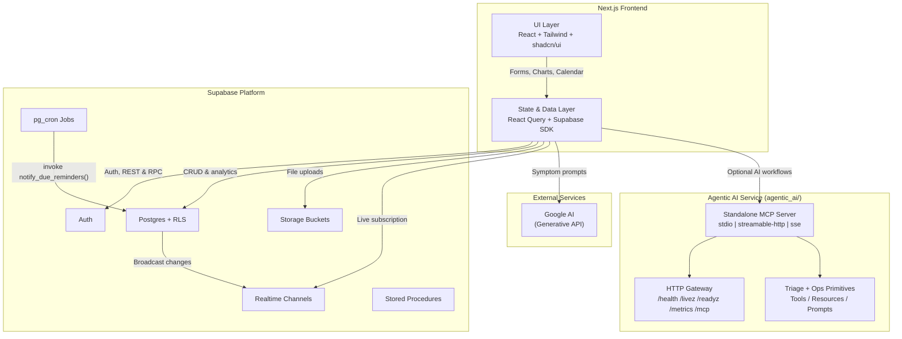
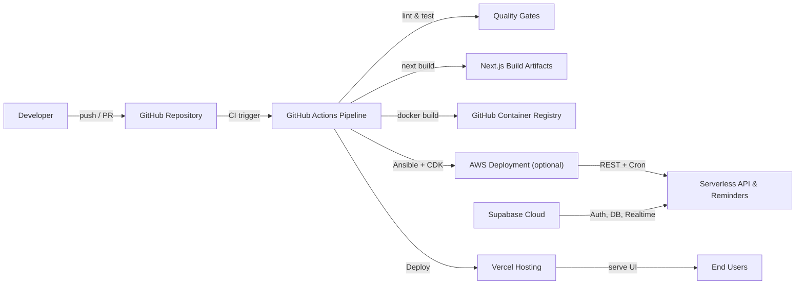

# Luminous Vitality - A Health Management Web App 💊

Build with patient care in mind, **NovaHealth** is a web application designed to help clients manage their health and wellness. It provides a comprehensive dashboard for tracking medications, appointments, and health logs, collect heart rate, sleep data etc from mobile, all while ensuring real-time synchronization across devices. With features like medication reminders, appointment tracking, and an AI-powered chatbot, AI-powered analyze, send alert/notification to clients, **NovaHealth** empowers users to take smarter control of their health journey and live healthier lives.


## Features

NovaHealth offers a range of features to help users manage their health effectively:
- **Main Features**: Analyze the frontend project under folder initial-frontend, and document under folder doc.
- **Make sure the following
- **Medication Reminders**: Schedule, edit, and delete recurring or one‑off med alerts.
  - **QR/Barcode Scanning**: Scan medication QR codes to auto-fill details. This can save time and reduce errors when entering medication information!
- **Appointment Tracking**: Log upcoming appointments with date/time and manage them.
- **Health Logs**: Record symptoms, mood, vitals, and notes; visualize trends over time.
- **Dashboard Visualizations**: Interactive charts for severity trends, symptom & mood distribution, and more.
- **Real‑Time Updates**: Broadcast channel notifications and Supabase Realtime keep all devices in sync instantly.
- **Pagination**: Efficient paginated fetching for large datasets (meds, appts, logs).
- **Notifications**: In-app reminders for due medications and appointments.
- **ICS Export/Import**: Export all events as an ICS calendar file or import from external calendars.
- **Calendar View**: Month/week/day/agenda views for all events, with drag-and-drop support.
- **Documents Page**: Upload/export and manage documents related to health records, prescriptions, etc.
- **Chatbot**: AI-powered chatbot for symptom analysis and health insights.
  - **Chatbot Actions**: The chatbot can now perform actions like fetching user data, scheduling reminders, and providing health tips based on user input on the user's behalf.
- **User Profiles**: Create and manage user profiles with personalized settings.
- **Medication Schedules**: Set up complex medication schedules with reminders.
- **Login/Signup**: Secure authentication via Supabase Auth.
- **Reset Password**: Password reset functionality for user accounts.
- **Dark Mode**: Toggle between light and dark themes for better accessibility.
- **Responsive Design**: Mobile-first design with a focus on usability across devices.

## Tech Stack

- **Front-End**
  - Next.js 16 & React 19 (TypeScript)
  - Tailwind CSS & Shadcn/ui components
  - Framer Motion for animations
  - react-chartjs-2 & Chart.js for charts
  - react-query for data fetching & caching
  - react-calendar for calendar view
  - lucide-icons for icons
- **Back-End / Data**
  - PostgreSQL (Auth, Postgres, Realtime, Storage, Cron)
- **Notifications & Sync**
  - Postgres Triggers for real-time updates
  - Postgres Cron Jobs for scheduled reminders
  - Postgres Broadcast Channels & `postgres_changes` for live updates & notifications

## Architecture Overview

The diagrams below summarize how SymptomSync is assembled across the client, data services, and deployment workflows. A much deeper dive (with additional sequence and ER diagrams) lives in [ARCHITECTURE.md](ARCHITECTURE.md).





- **Supabase**: The backend is powered by Supabase, which provides a Postgres database, authentication, and real-time capabilities.
  - Each table is protected by **Row Level Security (RLS)** policies to ensure user data isolation, so that users can only access/update/delete their own data.
- **Realtime Broadcast**: Any create/update/delete triggers both a `postgres_changes` subscription and a broadcast message so all open clients show a toast notification.
- **Cron Jobs**: Scheduled jobs (via Supabase Cron) that scan upcoming reminders and dispatch notifications every second.
- **Postgres Triggers**: Database triggers that listen for changes in the `medication_reminders`, `appointment_reminders`, and `health_logs` tables, and send messages to the broadcast channel.
  - There is also a trigger on the `auth.users` table to create a corresponding `user_profiles` entry when a new user signs up.
- **AI Chatbot**: The chatbot uses the Google AI API to analyze user symptoms and provide health insights.

## Installation

1. Clone the repo

   ```bash
   git clone https://github.com/hoangsonww/SymptomSync-Health-App.git
   cd SymptomSync-Health-App
   ```

2. Open the project in your favorite code editor (e.g., VSCode). When prompted by your IDE, select "Open in Container" to open the project in a Docker container. Alternatively, if using VSCode, you can use the Remote - Containers extension to open the project in a container.
   > [!CAUTION]
   > This is very important as the project uses Docker to run the database and other services. If you don't have Docker installed, please install it first.
3. Install dependencies (Remember to use `--legacy-peer-deps` if you encounter issues with React versions being incompatible with Shadcn/ui)
   ```bash
   npm install --legacy-peer-deps
   ```
4. Copy `.env.example` → `.env.local` and fill in your Supabase credentials
   ```bash
   NEXT_PUBLIC_SUPABASE_URL=…
   NEXT_PUBLIC_SUPABASE_ANON_KEY=…
   NEXT_PUBLIC_GOOGLE_AI_API_KEY=…
   ```
5. Run the dev server
   ```bash
   npm run dev
   ```

## Configuration

- **Supabase**

  - Configure **Auth** settings in the Supabase dashboard
    - Enable email/password signups
    - Uncheck the confirmation email option for now
  - Create tables: `user_profiles`, `medication_reminders`, `appointment_reminders`, `health_logs`, `files`, and `user_notifications` and enable Realtime for all of them.
    - Set relationships between tables using Foreign Keys.
  - Add RLS policies for user isolation to the tables. All tables should have the following policies or similar:
    - `select`: `auth.uid() = user_profile_id`
    - `insert`: `auth.uid() = user_profile_id`
    - `update`: `auth.uid() = user_profile_id`
    - `delete`: `auth.uid() = user_profile_id`
  - Set up **Cron** jobs to run `send_reminders()` stored procedure daily/hourly or even every second.
    - To do so, you might need to enable the `pg_cron` extension in your Supabase project.
  - Create **Postgres Functions** to handle the logic for sending notifications and reminders
    - `send_reminders()`: Check for upcoming reminders and send notifications
    - `create_user_profile()`: Create a new user profile when a user signs up
  - Define **Database Triggers** to write to broadcast channels on insert/update/delete and to create a new user profile on signup
  - Set up **Storage** for file uploads. Create 2 buckets: `avatars` and `documents`

- **Environment**
  - `.env.local` holds all keys (refer to `.env.example`)
  - Default port: `3000`

## Supabase Schema

SymptomSync uses the following tables in Supabase:

- `user_profiles`
- `medication_reminders`
- `appointment_reminders`
- `health_logs`
- `files`
- `user_notifications`
- `auth.users` (Supabase Auth table)
- `auth.refresh_tokens` (Supabase Auth table)
- `auth.user_attributes` (Supabase Auth table)
- `auth.user_mfa` (Supabase Auth table)
- and more...

These tables are used to store user profiles, medication reminders, appointment reminders, health logs, uploaded files, and user notifications. The schema is designed to ensure data integrity and security through Row Level Security (RLS) policies.

Below is a diagram of the Supabase schema used in SymptomSync:

<p align="center">
  
</p>

## Usage

1. Sign up / log in via Supabase Auth.
2. On the **Home** dashboard, add new medications, appointments, or health logs.
3. View interactive charts - severity trends, symptom distribution, appointment patterns.
4. Navigate to **Calendar** to see a month/week/day/agenda view of all events, add events, or even import/export ICS.
5. All changes sync in real‑time across open tabs/devices; cron‑driven reminders notify you via in-app notifications.
6. Use the **Documents** page to upload/export health records, prescriptions, etc.
7. Chat with the **AI Chatbot** for symptom analysis and health insights.
8. Toggle between light and dark mode for better accessibility.
9. View and manage your **profile**. You can also view other users' profiles.
10. Visit the **Medication Schedules** page to view/edit a complete list of your medications and their schedules.

## Agentic AI

NovaHealth’s Agentic AI stack lives in `agentic_ai/` and combines a modular MCP server, a LangGraph multi-agent pipeline, LangChain chains, and retrieval-backed context.

- **Standalone MCP Server (Model Context Protocol)**: The service runs as an MCP server with `stdio`, `streamable-http`, and `sse` transports, exposing tools/resources/prompts for hosts and agents.
- **Expanded MCP Capability Surface**: The current server exposes 21 tools, 8 resources, and 6 prompts across core analysis, deterministic triage, operational diagnostics, and workflow templates.
- **Graph-Backed Symptom Pipeline (LangGraph)**: A stateful assembly line executes `SymptomExtractor -> KnowledgeRetriever -> DiagnosticAnalyzer -> RiskAssessor -> RecommendationGenerator`, with an `Orchestrator` controlling loop/stop/escalation behavior.
- **LangChain Integration**: The service uses LangChain prompt/chains for symptom and retrieval workflows, plus model adapters for provider-backed inference and structured response generation.
- **Retrieval and Vector Context**: The default RAG implementation uses **Chroma** + embeddings for medical-context retrieval; runtime settings also include vector-store configuration knobs used in deployment environments.
- **Symptom & Risk Decision Support**: The MCP layer includes deterministic helpers for triage heuristics, urgency explanation, risk scoring, care-setting recommendation, monitoring schedules, emergency checklists, and clinician handoff summaries.
- **Operational/SRE Controls**: The MCP gateway provides `/health`, `/livez`, `/readyz`, `/metrics`, and `/mcp`, along with optional bearer auth, per-identity HTTP rate limiting, dependency checks, and runtime policy validation/fail-fast behavior.
- **In-App Action Execution**: The chat workflow can turn natural-language intents into concrete create/update/delete actions for medication reminders, appointment reminders, and health logs after parsing validated action payloads.
- **Guardrails**: The system is guidance-oriented and includes medical disclaimers; it does not autonomously prescribe medication or perform deterministic appointment optimization outside explicit user-driven workflows.
For more details on how Agentic AI is integrated into SymptomSync, refer to the [AI Integration Documentation](agentic_ai/README.md).
