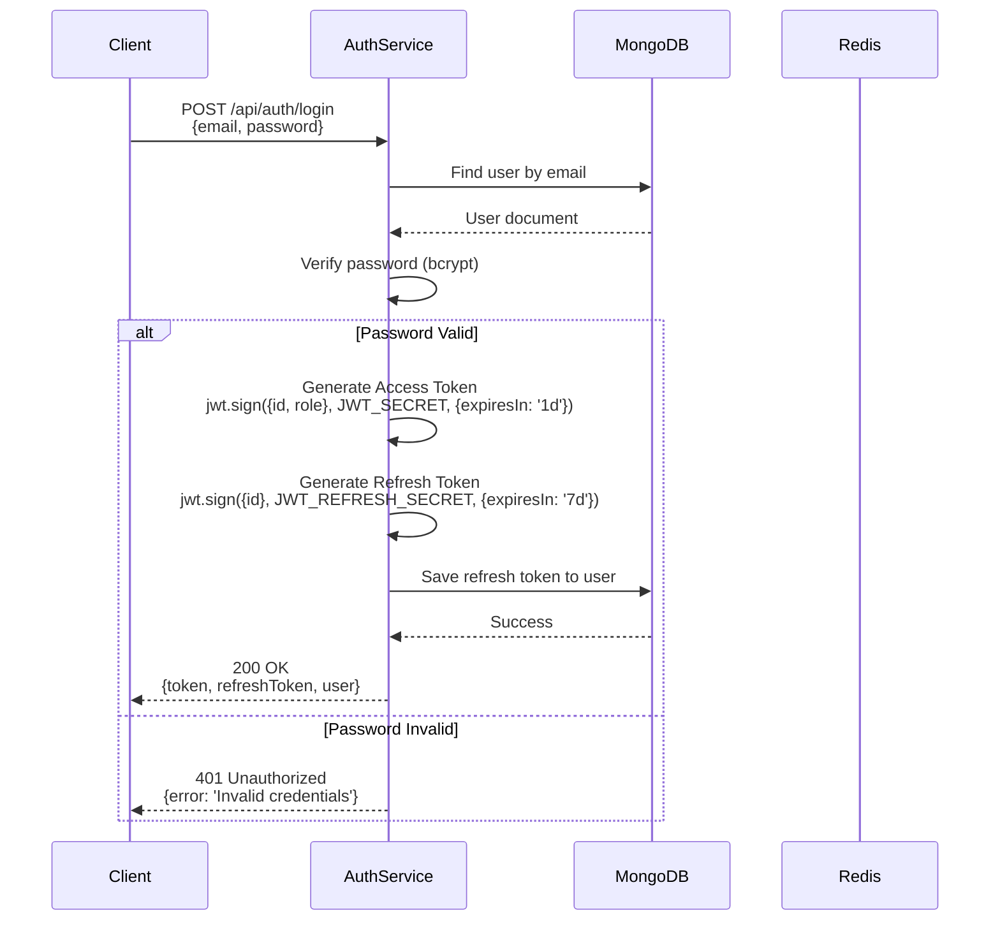
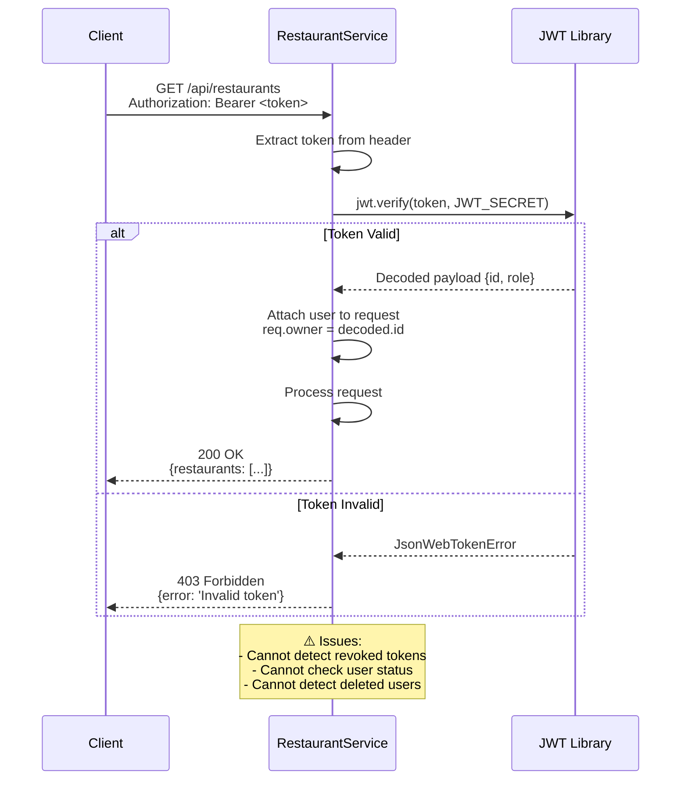
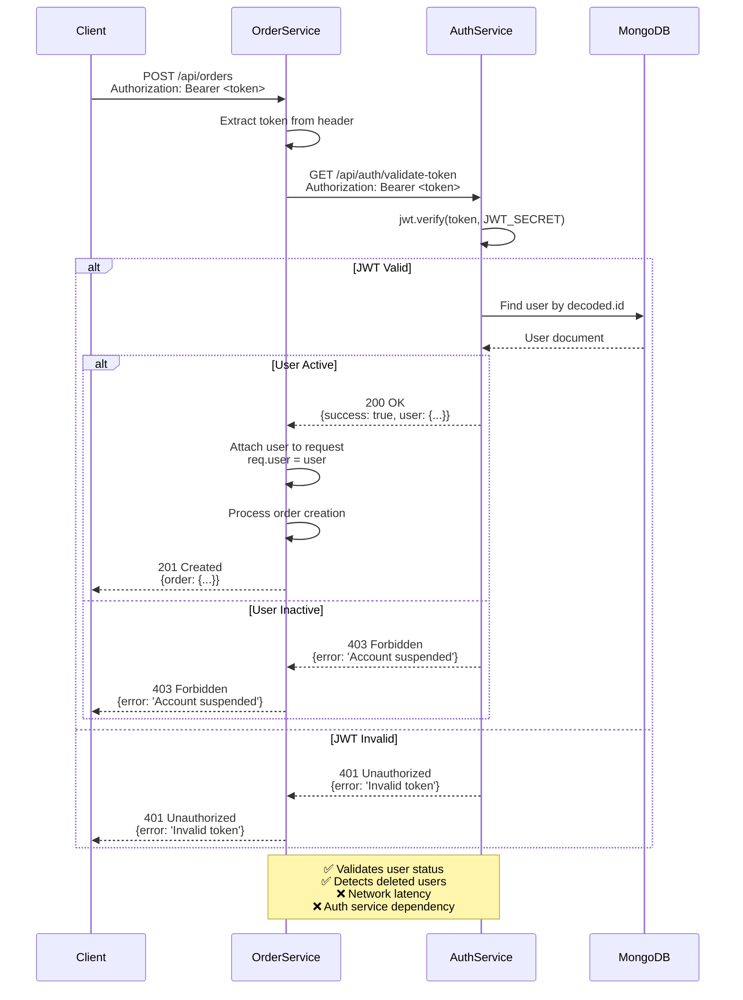
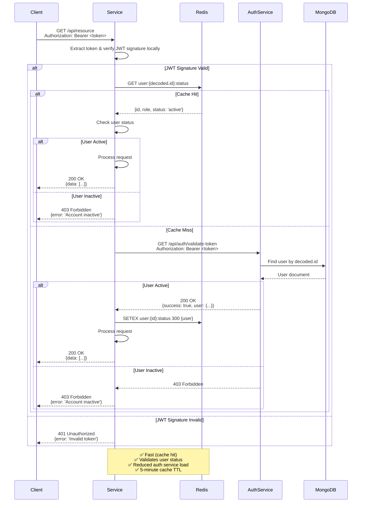
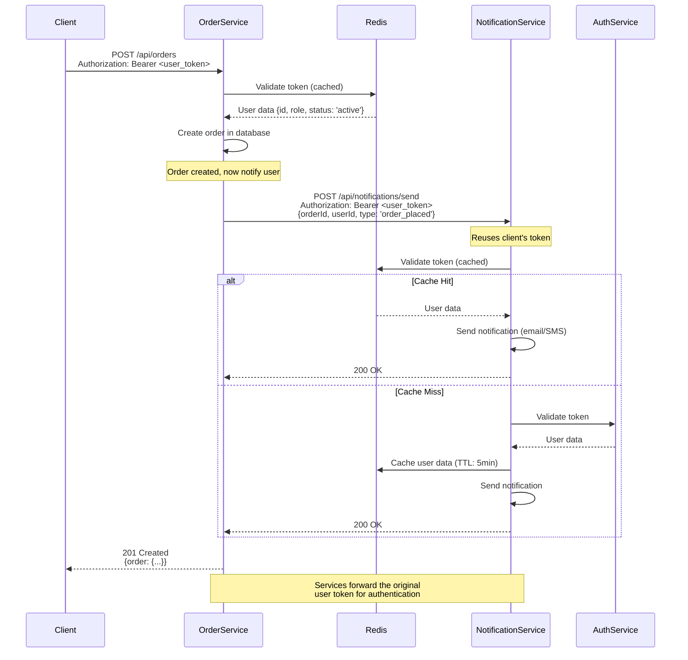
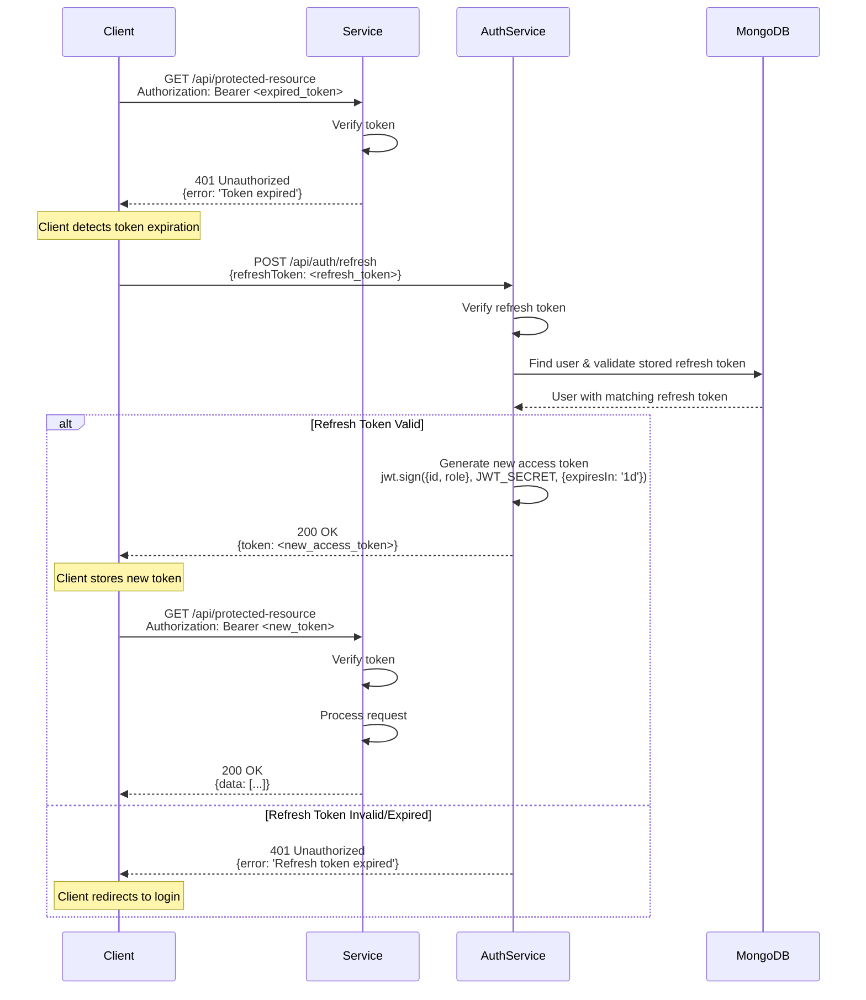
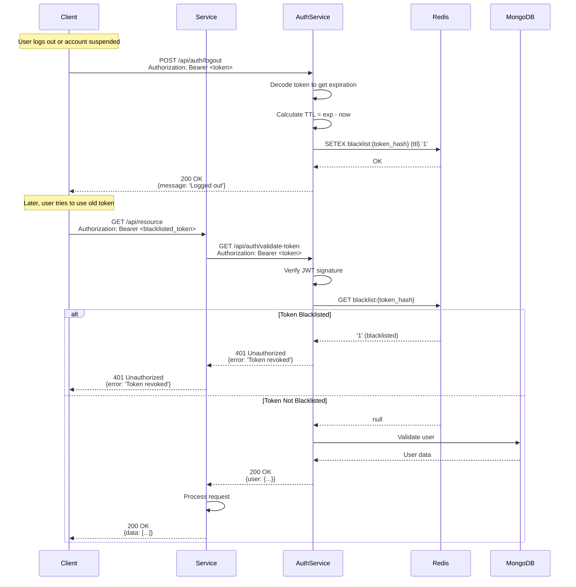
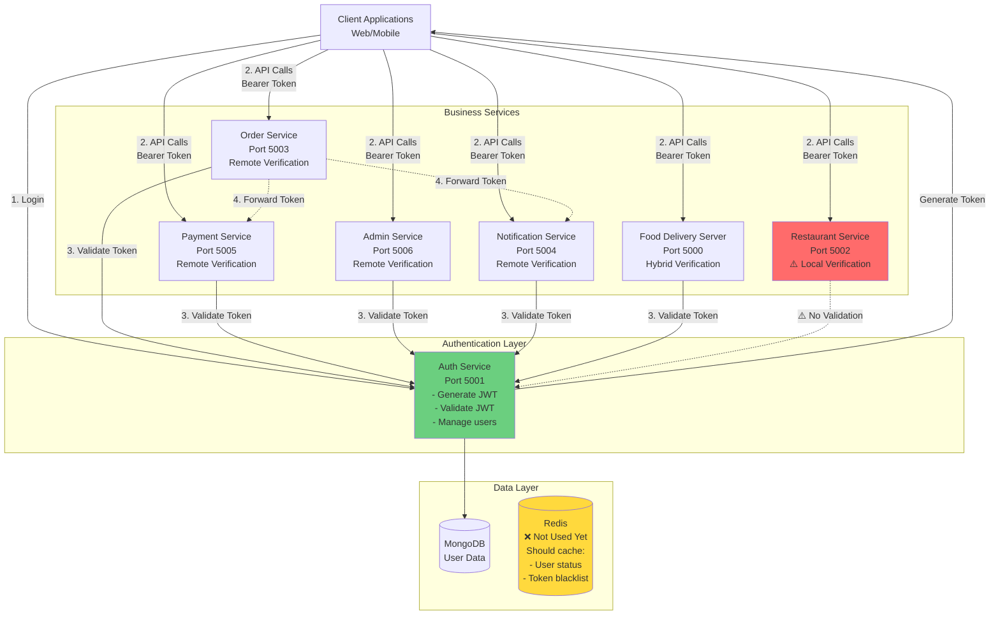
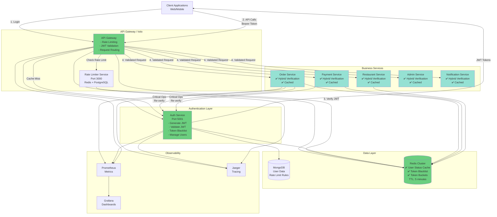
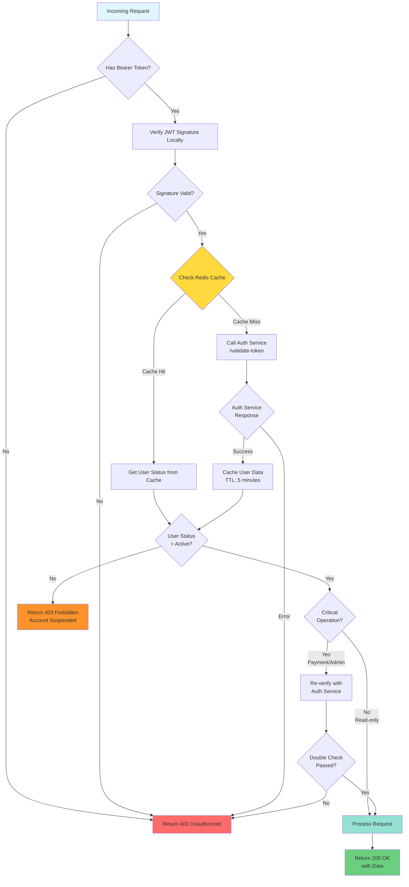

# JWT Authentication Flow Diagrams

## 1. Token Generation Flow

## 2. Pattern 1: Local Verification (Restaurant Service)

## 3. Pattern 2: Remote Verification (Admin/Order/Payment/Notification Services)

## 4. Pattern 3: Hybrid with Caching (Recommended)

## 5. Service-to-Service Communication

## 6. Token Refresh Flow

## 7. Token Revocation Flow (Recommended)

## 8. Current Architecture Overview

## 9. Recommended Future Architecture

## 10. Security Decision Tree

---

## Legend

- 🟢 **Green**: Recommended/Good practice
- 🟡 **Yellow**: Needs improvement
- 🔴 **Red**: Security issue/Anti-pattern
- ✅ **Checkmark**: Implemented/Working
- ❌ **X**: Not implemented/Broken
- ⚠️ **Warning**: Potential issue

---

## Key Takeaways

1. **Three Verification Patterns** exist in the current system (inconsistent)
2. **Remote Verification** is most secure but slowest
3. **Hybrid with Caching** provides best balance (security + performance)
4. **API Gateway** should handle primary JWT validation
5. **Redis Caching** reduces auth service load by 95%+
6. **Token Blacklist** enables instant revocation
7. **Rate Limiting** prevents abuse of validation endpoints
