# Architecture Diagrams

Visual representations of the microservices e-commerce platform architecture.

---

## System Architecture Overview

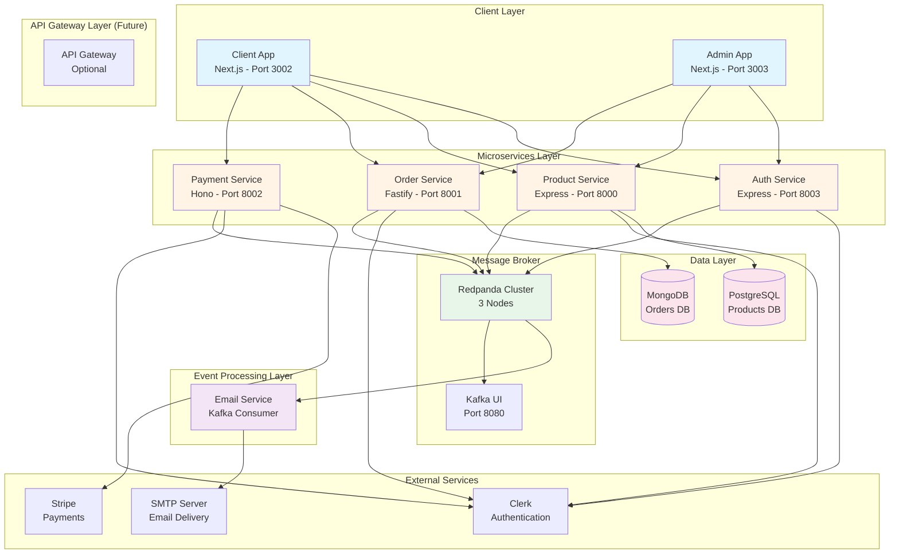

---

## Data Flow: User Registration

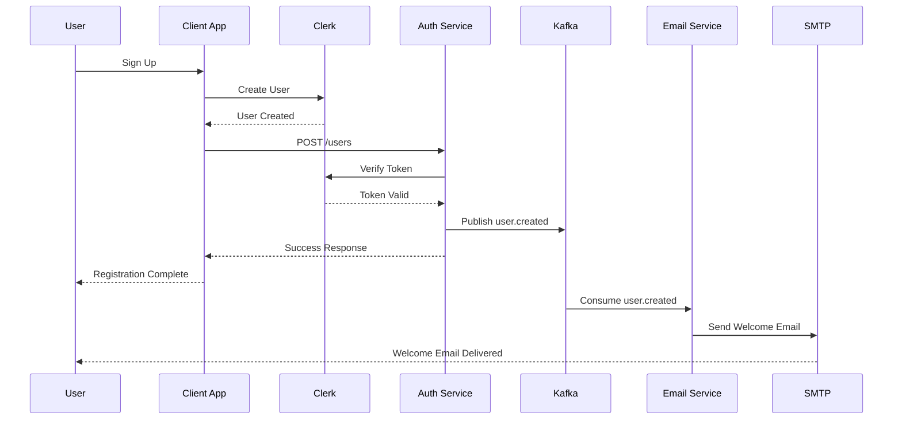

---

## Data Flow: Product Purchase

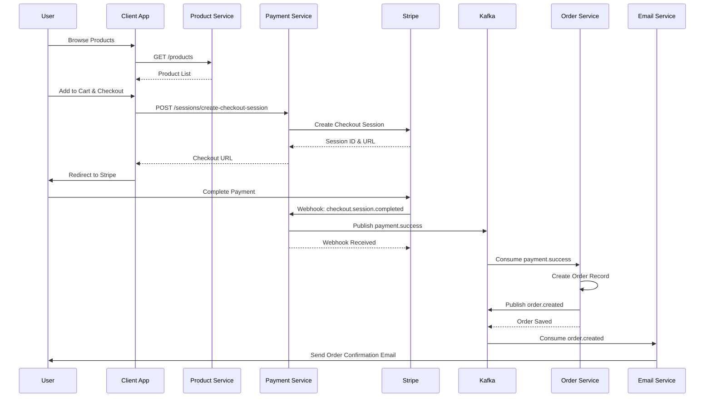

---

## Service Communication Patterns

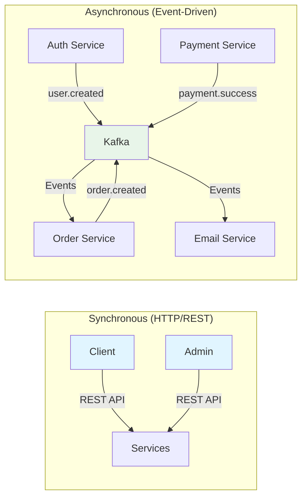

---

## Database Architecture

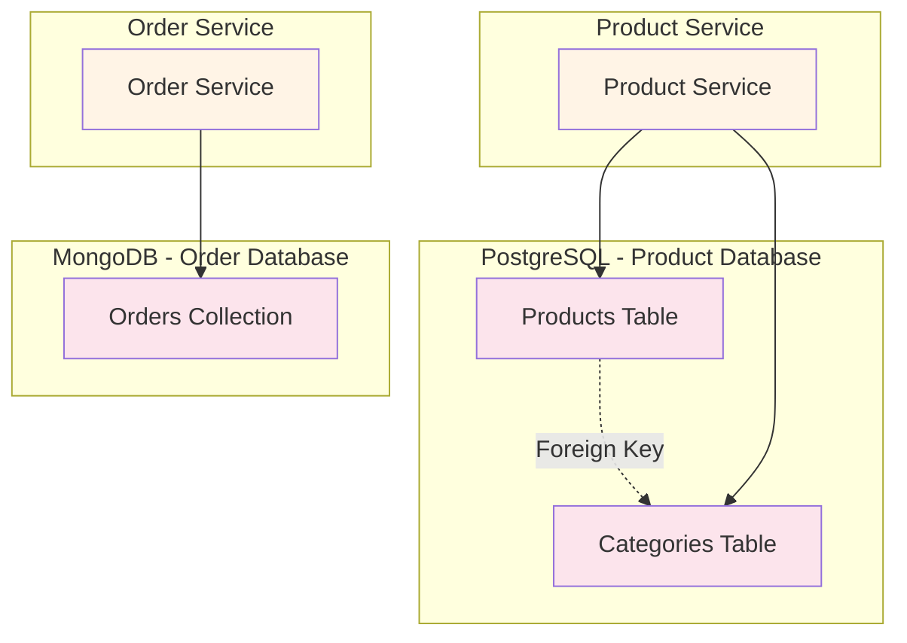

---

## Monorepo Structure

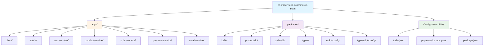

---

## Deployment Architecture (Future)

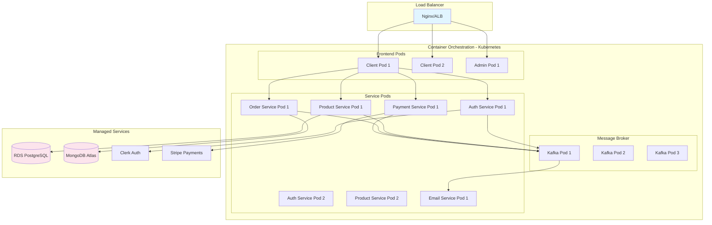

---

## Kafka Topic Flow

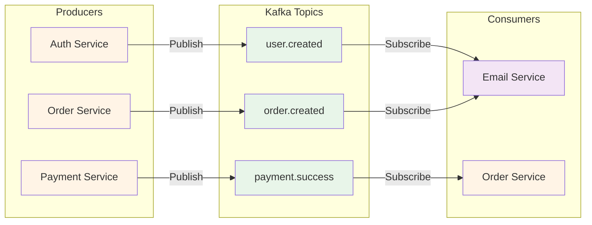

---

## Authentication Flow

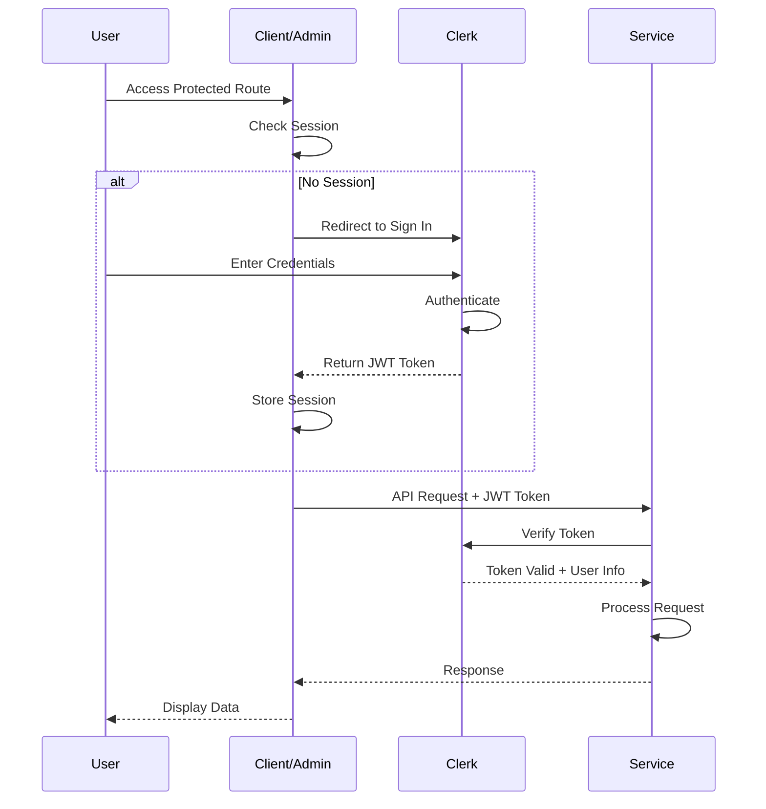

---

## Error Handling Flow

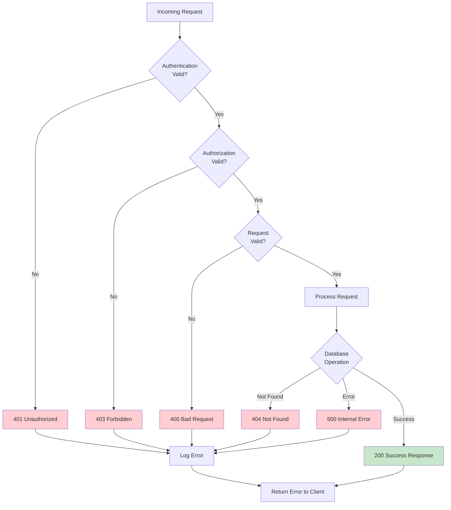

---

## Scaling Strategy

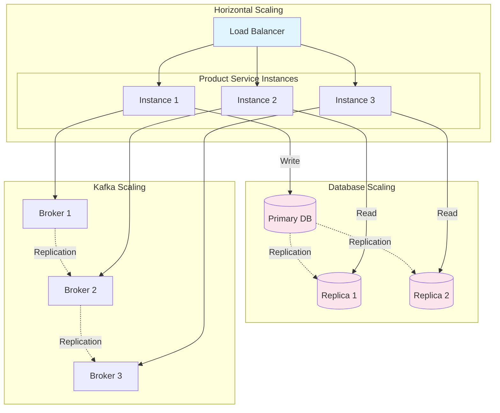

---

## Technology Stack Visualization

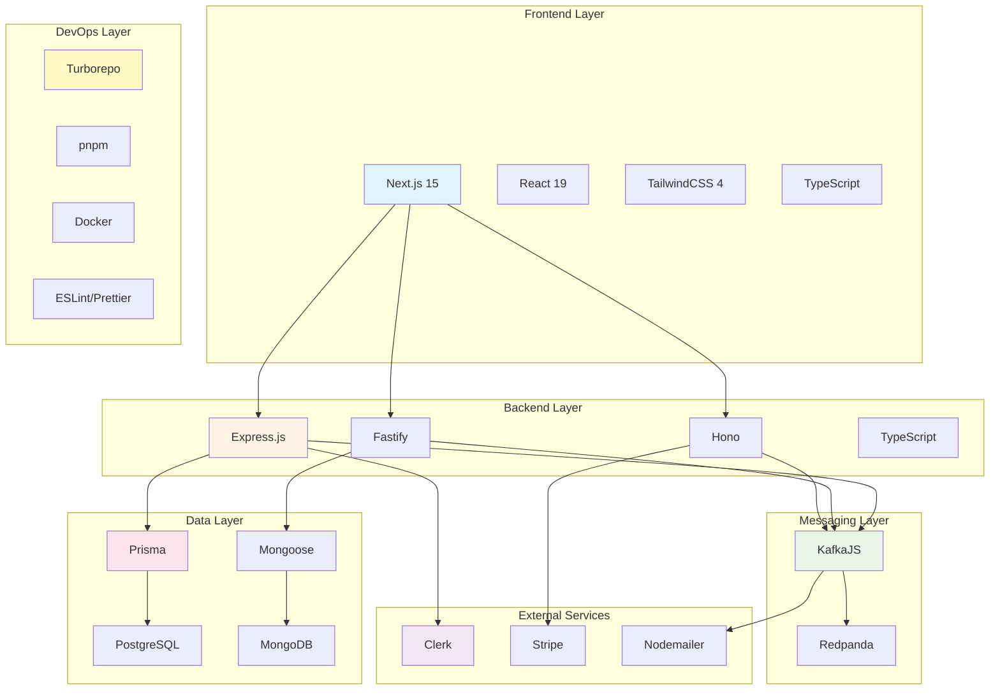

---

For detailed documentation, see:
- [PROJECT_DOCUMENTATION.md](./PROJECT_DOCUMENTATION.md) - Complete architecture details
- [QUICK_START.md](./QUICK_START.md) - Setup instructions
- [API_REFERENCE.md](./API_REFERENCE.md) - API documentation
